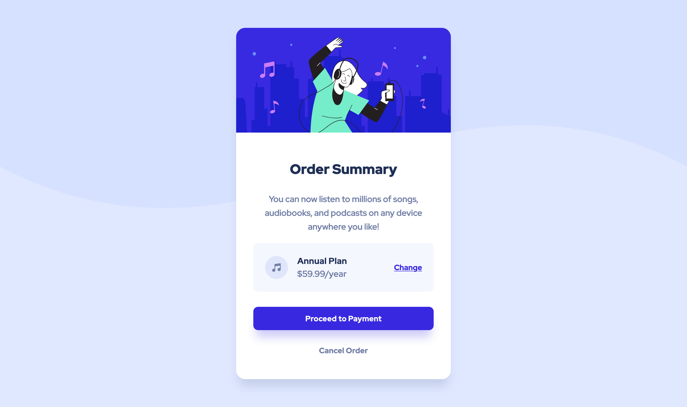

# Frontend Mentor - Order summary card solution

This is a solution to the [Order summary card challenge on Frontend Mentor](https://www.frontendmentor.io/challenges/order-summary-component-QlPmajDUj). Frontend Mentor challenges help you improve your coding skills by building realistic projects. 

## Table of contents

- [Overview](#overview)
  - [The challenge](#the-challenge)
  - [Screenshot](#screenshot)
  - [Links](#links)
- [My process](#my-process)
  - [Built with](#built-with)
  - [What I learned](#what-i-learned)
  - [Continued development](#continued-development)
  - [Useful resources](#useful-resources)
- [Author](#author)

## Overview

### The challenge

Users should be able to:

- See hover states for interactive elements

### Screenshot

### Links

- [Solution URL](https://github.com/dgatialy/fem-order-summary-component)
- [Live Site URL](https://thirsty-almeida-030b8b.netlify.app/)

## My process

### Built with

- Semantic HTML5 markup
- SASS
- Flexbox 
- Parcel
- Netlify

### What I learned

- Dieses Mal nicht in Figma nachgebaut, sondern das Design als Background über den Code gelegt. In Figma zu beginnen hat sich jedoch als vorteilhaft herausgestellt, um Spacings und Farben später besser extrahieren zu können.
- Fluide Spacing und Typographie scheint mir nach wie vor Arbeit abzunehmen. Anstatt für verschiedene Breakpoints die Spacings und Schriftgrößen manuell/absolut zu definieren. Bedeutet aber auch, dass damit kein pixelgenaues Design möglich war. Aber Look & Feel bleibt erhalten.

### Continued development

Use this section to outline areas that you want to continue focusing on in future projects. These could be concepts you're still not completely comfortable with or techniques you found useful that you want to refine and perfect.

### Useful resources

- [The Power of Composition with CSS Variables](https://blog.maximeheckel.com/posts/the-power-of-composition-with-css-variables/) Use CSS variables for colors in combination with alpha values.

## Author
- Frontend Mentor - [@dgatialy](https://www.frontendmentor.io/profile/dgatialy)